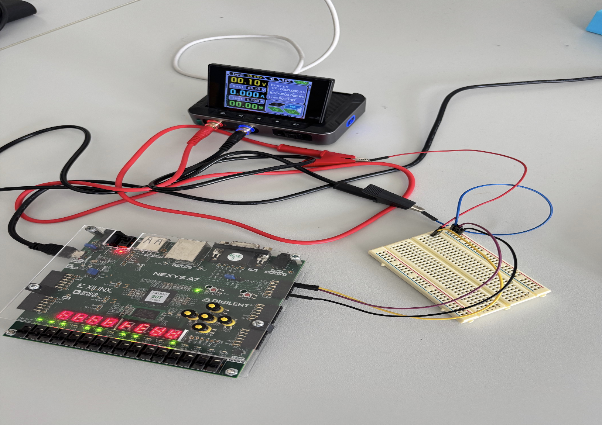
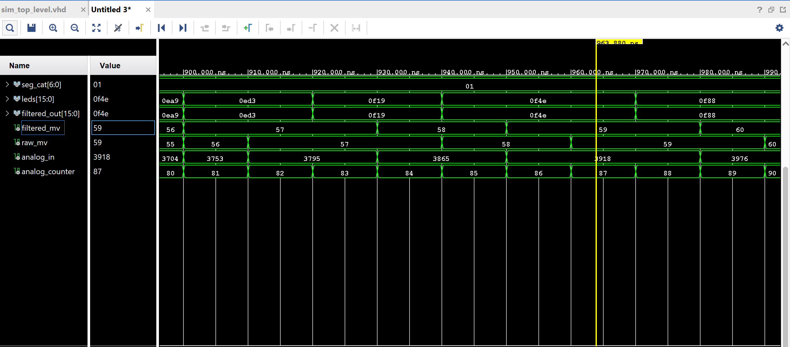
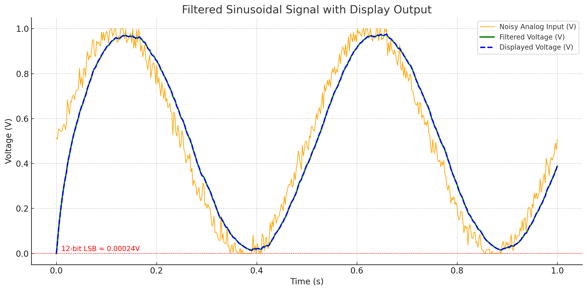
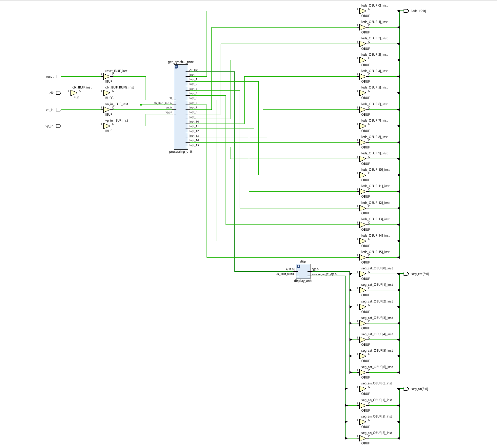

# ADC-converter
# 🎛️ ADC Signal Filtering on Nexys A7

This FPGA project demonstrates how to digitize and filter an analog signal using Xilinx's XADC, and display the result in real-time on 7-segment displays and LEDs. Implemented in VHDL for the Digilent Nexys A7 board.

---

## 📦 Features

- 🔌 Analog input via XADC (`vp_in`, `vn_in`)
- 📉 Digital IIR low-pass filtering
- 📟 Real-time display on 7-segment
- 💡 LED binary display of filtered data
- 🧪 VHDL testbench simulation
---
## 🕹️ Hardware Overview
- This photo captures the live testing setup of an analog signal acquisition and filtering system using a Digilent Nexys A7-50T FPGA board, external DC power source, and a breadboard interface:


🧩 ***Components in the Photo:***
🔋 **Power Source**

- A programmable DC power supply is shown providing a regulated analog voltage.

- Output voltage in use: 0.10V (shown on display).

📟 **Nexys A7-50T FPGA**

- Hosts the VHDL logic for ADC read, filtering, display, and LED output.

- Connected to PC via USB (for programming and power).

- Seven-segment display actively showing filtered ADC values.

🔌 **Connections**

- JXADC Header (Analog Input):

- AN3P (positive input) → Connected to the positive output of power supply (red wire).

- AN3N (negative input) → Connected to GND of power supply (black wire).

- GND → Common ground shared between FPGA, breadboard, and power source.

🧪 **Breadboard**

- Used for voltage routing and tap points.

- No active components—acts as a connection hub between source and analog pins.

---

## 🧠 Architecture Overview
 Stage | Component | Description | Output |
|-------|-----------|-------------|--------|
| 1 | **DC Source** | External analog voltage source or function generator connected to analog pins | Analog voltage signal |
| 2 | **Nexys A7 Board** | FPGA board that hosts the digital signal processing system | Internal signal flow |
| 3 | **XADC** (`processing_unit.vhd`) | Xilinx Analog to Digital Converter: Converts analog voltage into 12-bit digital value | Digital 12-bit raw ADC sample |
| 4 | **IIR Filter** (`processing_unit.vhd`) | Applies low-pass filter using exponential smoothing to reduce noise | Smoothed digital signal |
| 5 | **Threshold Logic** (`processing_unit.vhd`) | Ignores minor changes under 10mV to suppress flicker and noise | Stable filtered signal |
| 6 | **Voltage Scaling** (`display_unit.vhd`) | Converts filtered 12-bit value to millivolts | Integer voltage in mV |
| 7 | **BCD Converter + 7-Segment Driver** (`display_unit.vhd`) | Converts mV into 4-digit BCD and multiplexes to 7-segment display | Real-time visual output on display |
| 8 | **LED Display** (`display_unit.vhd`) | Mirrors the 16-bit filtered signal on the onboard LEDs | Binary indicator of signal level |
---

## 📂 File Structure

| File | Role |
|------|------|
| `top_level.vhd` | Connects all components |
| `processing_unit.vhd` | Handles XADC + filtering |
| `display_unit.vhd` | Converts value to voltage, updates 7-seg/LEDs |
| `fir_pkg.vhd` | Type definitions for filter dev(No longer used in project, not connected to any file) |
| `nexys_a7.xdc` | FPGA pin constraints |
| `sim_top.vhd` | Testbench for simulation |

---

## 🔍 File-by-File Breakdown

## 1.`top_level.vhd`
 🧠 **Role: System Integrator**
 
 This file defines the **top-level VHDL entity** for the entire system. It glues together the major components:
 - `processing_unit`: captures and filters the analog signal
 - `display_unit`: outputs the filtered result both digitally and visually
 
 
 🧩 **Interfaces Entity: `top_level`**
  ```vhdl 
entity top_level is
  port (
    clk       : in  std_logic;
    reset     : in  std_logic;
    vp_in     : in  std_logic;
    vn_in     : in  std_logic;
    seg_an    : out std_logic_vector(3 downto 0);
    seg_cat   : out std_logic_vector(6 downto 0);
    leds      : out std_logic_vector(15 downto 0)
  );
end entity;
```
 **Inputs**:
 - `clk`: Main system clock  
 - `reset`: Global synchronous reset  
 - `vp_in`, `vn_in`: Differential analog voltage inputs for XADC  
 
 **Outputs**:
 - `leds`: 16-bit binary display of the filtered signal  
 - `seg_cat`, `seg_an`: 7-segment cathode/anode display drivers  
 
  🏗️ **Component Declaration: `processing_unit` and `display_unit`**
 ```vhdl
 component processing_unit
  port (
    clk          : in  std_logic;
    reset        : in  std_logic;
    vp_in        : in  std_logic;
    vn_in        : in  std_logic;
    filtered_out : out std_logic_vector(15 downto 0)
  );
end component;
```
- Filters incoming analog signals and outputs 16-bit digital data.

 ```vhdl
component display_unit
  port (
    clk       : in  std_logic;
    reset     : in  std_logic;
    data_in   : in  std_logic_vector(15 downto 0);
    seg_cat   : out std_logic_vector(6 downto 0);
    seg_an    : out std_logic_vector(3 downto 0);
    leds      : out std_logic_vector(15 downto 0)
  );
end component;

```
- Converts 16-bit input data to visual output (7-segment + LEDs).

 🔧  **Internal Signal:**
 The top-level logic instantiates both components and connects them through internal signals:

 ```vhdl
 signal filtered : std_logic_vector(15 downto 0);
  ```
- A bridge signal connecting `processing_unit` output to `display_unit` input.
    
 ⚙️ **Component Instantiations: `processing_unit` and `display_unit`**
 ```vhdl
core : processing_unit
  port map (
    clk          => clk,
    reset        => reset,
    vp_in        => vp_in,
    vn_in        => vn_in,
    filtered_out => filtered_signal
  );
```
- Routes clock/reset and analog inputs to the processor.
- Outputs filtered data to `filtered_signal`.

 ```vhdl
disp : display_unit
  port map (
    clk     => clk,
    reset   => reset,
    data_in => filtered_signal,
    seg_cat => seg_cat,
    seg_an  => seg_an,
    leds    => leds
  );
```
- Feeds filtered signal into display logic.
- Drives visual hardware outputs.

## 2.`processing_unit.vhd`

 🧠 **Role: Signal Acquisition & Filtering**
 
This module captures analog voltage via XADC and performs basic signal smoothing or filtering. It acts as the brain of the signal processing chain.

-Interfaces directly with differential analog inputs (`vp_in`, `vn_in`)
-Converts analog signal to digital using XADC
-Applies a simple smoothing filter (like averaging)
-Outputs a 16-bit digital result (`filtered_out`)
 
 
 🧩 **Interfaces Entity: `processing_unit`**
  ```vhdl 
entity processing_unit is
  port (
    clk          : in  std_logic;
    reset        : in  std_logic;
    vp_in        : in  std_logic;
    vn_in        : in  std_logic;
    filtered_out : out std_logic_vector(15 downto 0)
  );
end entity;
```
 **Inputs**:
 - `clk`: Main system clock  
 - `reset`: Global synchronous reset  
 - `vp_in`, `vn_in`: Differential analog voltage inputs for XADC  
 
 **Outputs**:
 - `filtered_out`: 16-bit filtered digital signal

 
  🏗️ **Component Declaration: `XADC`**
 ```vhdl
component XADC
  port (
    DCLK        : in  std_logic;
    RESET       : in  std_logic;
    VAUXP       : in  std_logic_vector(15 downto 0);
    VAUXN       : in  std_logic_vector(15 downto 0);
    VP          : in  std_logic;
    VN          : in  std_logic;
    ALM         : out std_logic_vector(7 downto 0);
    DO          : out std_logic_vector(15 downto 0);
    DRDY        : out std_logic;
    DEN         : in  std_logic;
    DADDR       : in  std_logic_vector(6 downto 0);
    DWE         : in  std_logic;
    DI          : in  std_logic_vector(15 downto 0);
    CONVST      : in  std_logic;
    CONVSTCLK   : in  std_logic;
    EOS         : out std_logic;
    BUSY        : out std_logic
  );
end component;

```
- **VP/VN**: Analog differential inputs.
- **DO[15:0]**: 16-bit output where only the upper 12 bits represent actual data (XADC is 12-bit).
- **DRDY**: Asserted when new data is ready.
- **DCLK**: Clock driving the ADC.
- The XADC internally samples the analog signal, digitizes it, and places the result on `DO`.

🔧 **Internal Signal:**
 ```vhdl
 signal adc_do        : std_logic_vector(15 downto 0);
signal adc_drdy      : std_logic;
signal filtered      : std_logic_vector(15 downto 0);
signal raw_val       : integer := 0;
signal smoothed_val  : integer := 0;
signal prev_output   : integer := 0;

  ```
- `adc_do`: XADC digital output (raw).
- `filtered`: Output that is passed to top_level.
- `raw_val`, `smoothed_val`: Intermediate values for filtering.

 ⚙️ **XADC Instantiations:**
 ```vhdl
u_xadc : XADC
  port map (
    DCLK        => clk,
    RESET       => reset,
    VP          => vp_in,
    VN          => vn_in,
    VAUXP       => (others => '0'),
    VAUXN       => (others => '0'),
    ALM         => alm,
    DO          => adc_do,
    DRDY        => adc_drdy,
    DEN         => den,
    DADDR       => daddr,
    DWE         => dwe,
    DI          => di,
    CONVST      => convst,
    CONVSTCLK   => convstclk,
    EOS         => eos,
    BUSY        => busy
  );
```
- Drives XADC with clock/reset and collects converted digital output.

🔄 **Conversion Note:**
```vhdl
raw_val <= to_integer(unsigned(adc_do(15 downto 4)));  -- Extract upper 12 bits
```
- The lower 4 bits of `DO` are discarded.
- Only bits 15 down to 4 are meaningful and this converts a 12-bit unsigned value to int.


🧹 **Filtering Logic: IIR Low-Pass:**
```vhdl
smoothed_val <= (raw_val + (smoothed_val * 7)) / 8;

```
This is a **first-order Infinite Impulse Response (IIR)** filter:
- Implements: `y[n] = (x[n] + 7 * y[n−1]) / 8`.
- Smooths the signal by blending 87.5% of the previous output and 12.5% of the current input.
```vhdl
if abs(smoothed_val - prev_output) > threshold then
  prev_output <= smoothed_val;
end if;
```

- **Debounce threshold**: Ignores small fluctuations < 10mV (approx).
- Prevents noise from updating the final output.
  
🔄 **Output Mapping:**
```vhdl
 filtered <= std_logic_vector(to_signed(prev_output, 16));
filtered_out <= filtered;
```
- Converts final filtered integer into a 16-bit signed vector.

- Why 16 bits?
 - Keeps compatibility with display and system bus widths. 
 - Ensures clean alignment with VHDL-wide standard integer types. 
 - 12-bit ADC value fits safely into 16-bit signed format with room for potential scaling.

📘 **Summary of Why and How:**

 Aspect | Reason / Role | 
|-------|-----------|
| **XADC** | 	Samples analog signal (12-bit resolution) |
| **raw_val** | extraction	Uses upper 12 bits (```adc_do(15 downto 4)```) |
| **Smoothing filter** |	Low-pass filter to reduce jitter/noise |
| **16-bit conversion** |	Ensures compatibility with system buses & display logic |
| **Threshold check** |	Reduces flickering from minor signal changes |


## 3.`display_unit.vhd`


 🧠 **Role: Visual Output Driver**
 
It takes a **16-bit filtered signal** `from processing_unit`, interprets it as a voltage in millivolts, splits the value into decimal digits, and drives a **multiplexed 7-segment display**. It also mirrors the raw signal to the 16 LEDs for debugging or direct monitoring.

 -Accepts a 16-bit digital signal (data_in)
 -Converts it into millivolts
 -Breaks it into individual decimal digits (BCD)
 -Displays it on a 4-digit 7-segment display
 -Mirrors the raw signal value on LEDs 

 🧩 **Interfaces Entity:  `display_unit`**   

 ```vhdl
   entity display_unit is
   port (
     clk       : in  std_logic;
     reset     : in  std_logic;
     data_in   : in  std_logic_vector(15 downto 0);
     seg_cat   : out std_logic_vector(6 downto 0);
     seg_an    : out std_logic_vector(3 downto 0);
     leds      : out std_logic_vector(15 downto 0)
   );
```


**Inputs:**

  - `clk`: System clock
  - `reset`: Synchronous reset
  - `data_in`: 16-bit filtered input data from `processing_unit`


 **Outputs**:
  - `leds`: Displays the full binary value for debugging or full-scale display
  - `seg_cat`, `seg_an`: Drives a 4-digit 7-segment display using multiplexing


 
 🔧 **Core Logic Overview**
 
   Aspect | Reason / Role |
 |-------|-----------|
 | **Binary to BCD Conversion** | 	The signed 16-bit input is converted to an absolute unsigned value for voltage display.|
 | **Digit Extraction** | Extracts individual decimal digits (thousands to units) from the ADC value. |
 | **7-Segment Encoder** |	Converts a digit (0–9) to the corresponding 7-segment encoding. |
 | **Multiplexing Controller** |	Rapidly switches between 4 digits using a refresh counter and `digit_index` signal. |

🔢 *Binary to BCD Conversion*

This part converts the 16-bit signed filtered signal to an unsigned value and then into millivolts:
```vhdl
abs_data <= unsigned(abs(signed(data_in)));
voltage_mv <= to_integer(abs_data(15 downto 4)) * 1000 / 4095;
```
- `data_in` is signed → converted to unsigned absolute value

- Only the top 12 bits are used (hence `15 downto 4`)

- The value is scaled from 0–4095 to 0–1000 mV

🔍 *Digit Extraction*

This breaks the millivolt value into four separate decimal digits for display:
```vhdl
val := voltage_mv;
bcd_digits(0) <= (val / 1000) mod 10; -- thousands
bcd_digits(1) <= (val / 100) mod 10;  -- hundreds
bcd_digits(2) <= (val / 10) mod 10;   -- tens
bcd_digits(3) <= val mod 10;          -- units
```
Each digit will be shown on one of the four 7-segment display digits.

💡 *7-Segment Encoder*

This selects the correct 7-segment pattern for the active digit:
```vhdl
case digit_val is
  when 0 => seg_raw <= "0000001";
  when 1 => seg_raw <= "1001111";
  when 2 => seg_raw <= "0010010";
  when 3 => seg_raw <= "0000110";
  when 4 => seg_raw <= "1001100";
  when 5 => seg_raw <= "0100100";
  when 6 => seg_raw <= "0100000";
  when 7 => seg_raw <= "0001111";
  when 8 => seg_raw <= "0000000";
  when 9 => seg_raw <= "0000100";
  when others => seg_raw <= "1111111"; -- blank
end case;

```
- `digit_val` selects which digit is currently being displayed.

- `seg_raw` drives segments a–g (active low).

  

🔄 *Multiplexing Controller*

This logic cycles through each of the 4 digits quickly (~1 kHz refresh rate):
```vhdl
refresh_cnt <= refresh_cnt + 1;
if refresh_cnt = 25000 then
  refresh_cnt <= 0;
  digit_index <= (digit_index + 1) mod 4;
end if;
```
Then selects the current active digit:
```vhdl
anodes <= (others => '1');           -- disable all digits
anodes(digit_index) <= '0';         -- enable one digit (active low)
```
- Only one digit is enabled at a time.

- Display appears stable due to persistence of vision.

 📊 **Internal Signals**
 
```vhdl
signal abs_data    : unsigned(15 downto 0);      -- Absolute value of signed input
signal bcd_digits  : array (0 to 3) of integer;  -- Stores 4 decimal digits
signal digit_index : integer range 0 to 3;       -- Tracks which digit is currently active
signal seg_raw     : std_logic_vector(6 downto 0); -- 7-segment output per digit
signal anodes      : std_logic_vector(3 downto 0); -- Controls active digit
```

📘 **Behavior Summary**

  - Mirrors data_in to leds.
  - Converts signed input to absolute decimal value (abs_data).
  - Periodically updates which digit is displayed using a refresh counter.
  -  Encodes the current digit value to 7-segment format.
  -  Activates one digit at a time using anode control (seg_an).


 
## 5.`nexys_a7.xdc`

🔍 **Overview**

This XDC file is used in Xilinx Vivado projects to:

- Assign logical ports in your HDL design (e.g., Verilog/VHDL) to physical pins on the FPGA.

- Define the I/O standard (electrical characteristics) for each port.

- Set up timing constraints (especially for clocks).

Most likely, this is for a board like the Basys 3 or Nexys A7, which includes:
- A clock input
- 16 LEDs
- A 4-digit 7-segment display
- XADC analog input pins
- A reset button

🕒 **Clock and Timing**
```vhdl
set_property -dict { PACKAGE_PIN E3 IOSTANDARD LVCMOS33 } [get_ports { clk }]
create_clock -add -name sys_clk_pin -period 10.00 -waveform {0 5} [get_ports { clk }]
```
- PACKAGE_PIN E3: Maps the clk input signal to physical FPGA pin E3.
- IOSTANDARD LVCMOS33: Uses the LVCMOS 3.3V voltage level standard.
- create_clock: Defines a clock constraint named sys_clk_pin with:
  - Period = 10 ns → Frequency = 100 MHz.
  - Waveform {0 5} = 50% duty cycle (clock high for 5ns, low for 5ns).

🧠 **Why it's needed:** Tells Vivado the timing characteristics of your clock source so it can perform proper static timing analysis.

---
⚡️ **XADC Analog Inputs**

```vhdl
set_property -dict { PACKAGE_PIN A13 IOSTANDARD LVCMOS18 } [get_ports { vp_in }]
set_property -dict { PACKAGE_PIN A14 IOSTANDARD LVCMOS18 } [get_ports { vn_in }]
```
- These two lines assign vp_in and vn_in ports to A13 and A14, which are dedicated analog input pins for the Xilinx XADC (Analog-to-Digital Converter).

- LVCMOS18 = 1.8V logic standard — required for analog input compatibility.

🧠 **Why it's needed:** Enables use of onboard sensors or other analog input for digitization within the FPGA.

---
🔁 **Reset Button**
```vhdl
set_property -dict { PACKAGE_PIN N17 IOSTANDARD LVCMOS33 } [get_ports { reset }]
```
- Assigns the reset signal (e.g., for resetting a state machine) to pin N17.
- Standard 3.3V logic.

🧠 **Why it's needed:** Provides a way to reset your logic design externally via a button on the board.

---
🔢 **7-Segment Display - Anodes**
```vhdl
set_property -dict { PACKAGE_PIN J17 IOSTANDARD LVCMOS33 } [get_ports { seg_an[0] }]
set_property -dict { PACKAGE_PIN J18 IOSTANDARD LVCMOS33 } [get_ports { seg_an[1] }]
set_property -dict { PACKAGE_PIN T9  IOSTANDARD LVCMOS33 } [get_ports { seg_an[2] }]
set_property -dict { PACKAGE_PIN J14 IOSTANDARD LVCMOS33 } [get_ports { seg_an[3] }]
```
- Assigns the control lines for each digit of a 4-digit 7-segment display.
- seg_an[0] through seg_an[3] enable each of the 4 digits.
- Active-low typically: driving low enables that digit.

🧠 **Why it's needed:** Allows time-multiplexed control of each 7-segment digit.

---
🔠 **7-Segment Display - Cathodes**
```vhdl
set_property -dict { PACKAGE_PIN T10 IOSTANDARD LVCMOS33 } [get_ports { seg_cat[0] }]
set_property -dict { PACKAGE_PIN R10 IOSTANDARD LVCMOS33 } [get_ports { seg_cat[1] }]
set_property -dict { PACKAGE_PIN K16 IOSTANDARD LVCMOS33 } [get_ports { seg_cat[2] }]
set_property -dict { PACKAGE_PIN K13 IOSTANDARD LVCMOS33 } [get_ports { seg_cat[3] }]
set_property -dict { PACKAGE_PIN P15 IOSTANDARD LVCMOS33 } [get_ports { seg_cat[4] }]
set_property -dict { PACKAGE_PIN T11 IOSTANDARD LVCMOS33 } [get_ports { seg_cat[5] }]
set_property -dict { PACKAGE_PIN L18 IOSTANDARD LVCMOS33 } [get_ports { seg_cat[6] }]
```
- These control the individual segments a–g (no decimal point here).
- When combined with an anode, lighting specific segments shows numbers or letters.

🧠 **Why it's needed:** To draw characters on the 7-segment display, your logic activates the correct segments and anodes.

---
💡 **LED Outputs**
```vhdl
set_property -dict { PACKAGE_PIN H17 IOSTANDARD LVCMOS33 } [get_ports { leds[15] }]
...
set_property -dict { PACKAGE_PIN V11 IOSTANDARD LVCMOS33 } [get_ports { leds[0] }]
```

- Allows your design to output binary patterns, status indicators, counters, etc.
- Each LED typically turns on when driven high, depending on board design.

---

## 6.`sim_top.vhd`

🧠 **Purpose of the Testbench**

This testbench simulates a design called top_level, which likely uses the Xilinx XADC to read analog signals, outputs to a 7-segment display, and drives LEDs. The testbench provides:
- Clock and reset signals
- Fake XADC behavior
- A mechanism to drive simulated analog values (filtered_inject)
---

🧩 **Library Declarations**
```vhdl
library ieee;
use ieee.std_logic_1164.all;
use ieee.numeric_std.all;
```
- Includes the standard logic types (like std_logic and std_logic_vector) and numeric operations (like to_unsigned) that are used in simulation and design.
---

📦 **Entity Declaration**
```vhdl
entity sim_top_tb is
end sim_top_tb;
```
- This is a testbench entity named sim_top_tb. Since it's a testbench, it has no ports—it's a top-level wrapper used only for simulation.
---

🏗️ **Architecture Declaration**
```vhdl
architecture test of sim_top_tb is
```
- Starts the architecture body named test.
---

🔧 **Component Declaration**
```vhdl
component top_level
  port (
    clk     : in  std_logic;
    reset   : in  std_logic;
    vauxp3  : in  std_logic;
    vauxn3  : in  std_logic;
    seg_an  : out std_logic_vector(3 downto 0);
    seg_cat : out std_logic_vector(6 downto 0);
    leds    : out std_logic_vector(15 downto 0)
  );
end component;
```
- Declares the Unit Under Test (UUT): your top-level hardware design.
- Matches the ports of your real top_level entity.
- Note: This version uses vauxp3 and vauxn3 instead of vp_in and vn_in from earlier—likely for simulating XADC input.
---

📶 **Signal Declarations**
```vhdl
signal clk     : std_logic := '0';
signal reset   : std_logic := '1';
signal vauxp3  : std_logic := '0';
signal vauxn3  : std_logic := '0';
signal seg_an  : std_logic_vector(3 downto 0);
signal seg_cat : std_logic_vector(6 downto 0);
signal leds    : std_logic_vector(15 downto 0);
```
- Internal signals to connect to the DUT (Device Under Test).
- Initializes clk to '0', reset to '1' (active), and others to '0'.

```vhdl
signal filtered_inject : std_logic_vector(15 downto 0) := (others => '0');
```
- Emulates a digital output from an ADC, possibly fed into top_level internally.
- Filled with simulated values over time (see stimulus process).

```vhdl
signal adc_clock : integer := 0;
```
- This signal is declared but unused. Likely leftover or placeholder for future clocking.
---

🔗 **Component Instantiation**
```vhdl
dut: top_level
  port map (
    clk     => clk,
    reset   => reset,
    vauxp3  => vauxp3,
    vauxn3  => vauxn3,
    seg_an  => seg_an,
    seg_cat => seg_cat,
    leds    => leds
  );
```
- Instantiates the top_level component.
- Connects internal signals declared above to the DUT ports.
---

🕒 **Clock Generator Process**
```vhdl
clk_proc: process
begin
  while true loop
    clk <= '1';
    wait for 5 ns;
    clk <= '0';
    wait for 5 ns;
  end loop;
end process;
```
- Creates a 100 MHz clock by toggling clk every 5 ns (period = 10 ns).
- Loops forever during simulation.
---

🔁 **Reset Process**
```vhdl
process
begin
  wait for 100 ns;
  reset <= '0';
end process;
```
- Asserts reset (reset = '1') at simulation start.
- Deasserts reset after 100 ns (reset = '0') to begin normal operation.
---

📈 **Stimulus Process (ADC Input Emulation)**
```vhdl
stimulus_proc: process
begin
  wait for 200 ns;

  -- Simulate rising filtered value
  for i in 0 to 4095 loop
    filtered_inject <= std_logic_vector(to_unsigned(i * 16, 16));
    wait for 100 ns;
  end loop;

  wait;
end process;
```
- Starts after 200 ns.
- Emulates an increasing analog voltage by incrementing a 12-bit value (scaled by 16 = left-shifted 4 bits) into a 16-bit signal.
- Each step waits 100 ns.
- Mimics rising voltage as if from a potentiometer or sensor.
---

🧪 **XADC Emulation**
```vhdl
vauxp3 <= '1' when filtered_inject > x"0100" else '0';
vauxn3 <= '0';
```
- Patches XADC input values:
  - Sets vauxp3 high if filtered_inject exceeds 0x0100 (256 in decimal).
  - Keeps vauxn3 low (representing ground).
- These signals mimic analog voltage behavior for simulation purposes.
---


# 🧪 Simulation Full Breakdown

- This simulation illustrates the behavior of the ADC signal filtering module over time, showcasing the interaction between raw input values, analog data, and filtered output.



- 📈 **Signal Trace Breakdown:**
    - `seg_cat[6:0]`: Segment control output for display (01)

    - `leds[15:0]` / `filtered_out[15:0]`: Mirror each other, showing the processed analog signal in hexadecimal (0f4e)

    - `filtered_mv` / `raw_mv`: Numeric representation of analog input in millivolts, both incrementing gradual (59 → 60)

    - `analog_in`: Raw analog input value (e.g. 3918, 3976) representing a digitized 12-bit ADC sample

    - `analog_counter`: Simple incrementing counter reflecting sampling index (87 → 90)

- ⏱️ **Timeline:**
    - At the 963.880 ns mark, the signals show:

    - Stable data transition

    - Properly synchronized sampling across all channels

    - Expected delay between raw_mv and filtered_mv, indicating the effect of the filtering algorithm

- Which fully coresponds to this diagram:


## 🧱 Schematic

